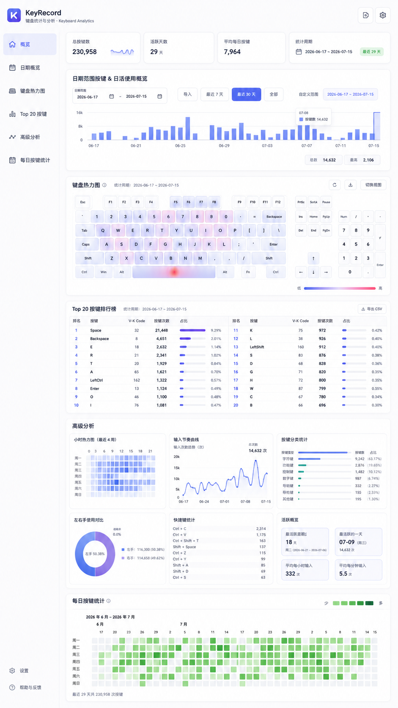

# KeyRecord - 跨平台键盘按键记录与可视化工具

[English](README.en.md) | 中文

在 Windows 10/11、Linux 和 macOS 上本地记录键盘事件，写入 SQLite 数据库，并通过内嵌 Web 页面展示按键统计和键盘热力图。



> 本项目会记录键盘输入。请仅在你拥有设备和数据使用权限的环境中运行，并妥善保护数据库文件。

## 功能特性

- **后台运行**：Windows/macOS 提供托盘或状态栏入口，Linux 默认以 headless 服务运行
- **平台原生采集**：Windows 使用低级键盘 Hook，Linux 使用 evdev，macOS 使用 CGEventTap
- **本地可视化**：内嵌静态页面和只读 HTTP 服务，无需 Node.js 运行时
- **基础统计**：记录每次按键的时间戳、日期和小时
- **按键识别**：记录每个按键的虚拟键码（vk_code）和键名（key_name）
- **支持的按键类型**：
  - 字母和数字：A-Z, 0-9
  - 功能键：F1-F12
  - 控制键：Enter, Space, Backspace, Tab, Esc
  - 方向键：Up, Down, Left, Right
  - 修饰键：Shift, Ctrl, Alt（包括左右区分）
  - 数字键盘：Numpad0-9, +, -, *, /, .
  - 其他特殊键：Home, End, PageUp, PageDown, Insert, Delete, PrintScreen 等
  - 标点符号：; = , - . / ` [ \ ] '

## 依赖

- CMake 3.20+
- SQLite3
- Windows：Visual Studio (MSVC) 与 vcpkg
- Linux：支持 C++20 的 GCC/Clang、Linux input headers
- macOS：Xcode Command Line Tools

Windows 安装 SQLite：
```powershell
# 使用 vcpkg
vcpkg install sqlite3:x64-windows
```

Boost.Beast 可视化服务器已接入当前工程；当前环境可以直接生成并运行 `keyrecord_server`，静态资源和 `/api/*` 查询已由 C++ 服务承载。旧的 Node.js 可视化服务端已归档到 `archive/node-server/visualize/`。

## 项目结构

```text
src/
  main.cpp                    # Windows GUI / Unix CLI 入口
  tray_app.*                  # 跨平台采集进程生命周期
  platform/                   # 平台采集、托盘、键码映射与平台工具
  key_event_writer.*          # SQLite 写入队列和批量落库
  config_path.*               # 配置目录与默认数据库路径解析
  app_config.*                # INI 配置文件解析（监听地址/端口、数据库位置）
  key_names.*                 # Windows VK code 到按键名映射
  key_classification.*        # 按键分类
  readonly_database.*         # 可视化服务只读 SQLite 连接
  api_queries.*               # /api/* 查询和 JSON 输出
  keyboard_layout.*           # 键盘热力图坐标映射
  embedded_resources.*        # 内嵌静态资源查找和 MIME 识别
  http_router.*               # HTTP 请求目标到静态资源/API 的适配层
  visualization_service.*     # 可视化服务运行时：只读库生命周期 + HTTP 请求转发
  server.*                    # Boost.Beast 监听与会话处理（检测到 Boost 时启用）
  server_bootstrap.*          # 服务端启动参数和默认配置解析
  server_startup.*            # 服务端启动前准备：打开只读服务并生成启动信息
  server_response_adapter.*   # HttpResponse 到 Beast response 的转换
  server_main.cpp             # 可视化服务端入口
  tests/                      # C++ 测试入口
cmake/
  GenerateEmbeddedResources.cmake
archive/node-server/visualize/
  server.js package*.json     # 已归档的旧 Node.js 可视化服务端
visualize/public/
  index.html css/ js/ vendor/ # 待内嵌的静态前端资源
```

当前 CMake 目标按功能拆分为：

- `keyrecord_capture`：采集端基础能力，包含 `key_names.*`、`key_event_writer.*`、`config_path.*` 与 `app_config.*`
- `config_path_tests`：默认数据库目录和目录自动创建规则
- `app_config_tests`：INI 配置文件解析、配置项优先级与数据库路径解析
- `keyrecord_visualization_core`：可视化查询核心，包含 `keyboard_layout.*`、`api_queries.*`、`readonly_database.*`
- `keyrecord_resources`：静态资源索引与 MIME 识别
- `keyrecord_http`：请求目标到静态资源/API 的适配层
- `keyrecord_visualization_service`：只读库生命周期 + HTTP 请求转发
- `server_bootstrap_tests`：服务端入口参数解析和默认路径规则
- `server_startup_tests`：服务端启动前数据库打开和启动信息生成
- `keyrecord_server`：仅在检测到 Boost.Beast/Asio 头文件时生成，承载网络监听入口

如果 Boost 已经存在于本机但不在 `C:/vcpkg/installed/x64-windows/include`，可以在生成工程时显式指定：

```powershell
cmake -B build -DKEYRECORD_BOOST_INCLUDE_DIR=C:\path\to\boost
```

这里的路径应当直接包含 `boost/beast.hpp` 和 `boost/asio.hpp`。

## 编译

```powershell
pwsh.exe -NoLogo -NoProfile -ExecutionPolicy Bypass -File .\build.ps1
```

脚本默认执行：

- CMake 配置到 `build/`
- 构建 `Release` 下的 `keyrecord_release_package`
- 生成 `build/keyrecord-windows-x64.zip`，包含 `keyrecord.exe`、运行所需 DLL、配置示例 `config.example.ini`，以及在启用 Boost.Beast/Asio 时一并包含 `keyrecord_server.exe`
- 构建 `Debug` 下的 `keyrecord_debug_tests` 并执行 `ctest`

仅构建、不跑测试：

```powershell
pwsh.exe -NoLogo -NoProfile -ExecutionPolicy Bypass -File .\build.ps1 -SkipTests
```

如果 Boost 头文件不在默认探测路径，可显式指定：

```powershell
pwsh.exe -NoLogo -NoProfile -ExecutionPolicy Bypass -File .\build.ps1 -BoostIncludeDir C:\path\to\boost
```

保留手工命令方式：

```powershell
cmake -B build
cmake --build build --config Release --target keyrecord_release_package
```

或使用 MSBuild：
```powershell
MSBuild.exe build\keyrecord.vcxproj /p:Configuration=Release /p:Platform=x64
```

## 跨平台构建（实验性）

构建系统支持 **Windows x64 / Linux x64 / macOS arm64** 三个目标，统一入口为 `CMakePresets.json`；GitHub Actions 会在三个目标平台构建、测试并验证发布包。

采集端已按平台接入 Windows `WH_KEYBOARD_LL`、Linux evdev 和 macOS CGEventTap；三者入库前都会归一化为 Windows VK 数值，以保持数据库、统计逻辑和前端键盘布局契约不变。

依赖安装：

- Windows：vcpkg（classic 模式）`vcpkg install sqlite3:x64-windows boost-asio:x64-windows boost-beast:x64-windows`
- Linux：`sudo apt-get install -y ninja-build libsqlite3-dev libboost-dev`
- macOS：`brew install ninja sqlite boost`

使用 presets 配置、构建与测试（Linux 示例，macOS 改用 `macos-arm64`）：

```bash
cmake --preset linux-x64
cmake --build --preset linux-x64-release   # 生成 build/keyrecord-linux-x64.tar.gz
cmake --build --preset linux-x64-tests
ctest --preset linux-x64
```

Linux 采集端直接读取 `/dev/input/event*`。运行用户必须对键盘事件设备有读权限，常见配置是加入 `input` 组后重新登录：

```bash
sudo usermod -aG input "$USER"
./build/Release/keyrecord
```

Linux 默认不引入桌面托盘依赖。仓库提供 `packaging/keyrecord.service`，安装为 systemd user service：

```bash
install -Dm755 build/Release/keyrecord ~/.local/bin/keyrecord
install -Dm644 packaging/keyrecord.service ~/.config/systemd/user/keyrecord.service
systemctl --user daemon-reload
systemctl --user enable --now keyrecord.service
```

macOS 首次启动会请求“输入监控”权限。授权后需要重新启动采集端：

```bash
./build/Release/keyrecord
```

在“系统设置 > 隐私与安全性 > 输入监控”中启用当前构建的 `keyrecord`。运行时可通过菜单栏的键盘图标退出。

Windows 既可用 `build.ps1`，也可用 presets：

```powershell
cmake --preset windows-x64
cmake --build --preset windows-x64-release
ctest --preset windows-x64
```

## 测试

```powershell
cmake --build build --config Debug --target keyrecord_debug_tests
ctest --test-dir build -C Debug --output-on-failure
```

当前测试覆盖：

- 采集端 SQLite 写入、WAL、索引和单引号按键写入
- 默认数据库目录 `~/.config/keyrecord`、目录自动创建和默认数据库文件路径
- 内嵌静态资源路径规范化、MIME 类型、路径穿越拒绝和 O(log N) 查找前提
- `/api/info`、`/api/daily-stats`、`/api/keys`、`/api/heatmap` 的 SQLite 查询结果
- HTTP 路由适配层的静态资源、API query 参数、CORS、OPTIONS、404、405
- 可视化服务运行时的只读库打开失败处理，以及静态资源/API 请求转发
- 服务端入口参数解析、默认数据库路径、启动前数据库打开和启动 banner 生成
- 配置文件（`config.ini`）的 INI 解析、配置项优先级、`db_dir`/`db_path` 与端口合法性校验
- 可视化服务只读 SQLite 连接

## 配置文件（可选）

采集端与服务端都会读取 `~/.config/keyrecord/config.ini`（即 `%USERPROFILE%\.config\keyrecord\config.ini`）。
该文件是可选的：不存在时全部使用内置默认值。优先级为 **内置默认值 < 配置文件 < 命令行参数**。

```ini
[server]
# 服务端监听地址，默认 0.0.0.0
address = 0.0.0.0
# 服务端监听端口，默认 3000（取值 1..65535）
port    = 3000         

[storage]
# 数据库文件完整路径
db_path = D:/data/keyrecord/keyrecord.db
# 或只给目录，文件名固定 keyrecord.db（db_path 优先于 db_dir）
# db_dir = D:/data/keyrecord               
```

- 以 `#` 或 `;` 开头的整行是注释；节名与键名大小写不敏感；非法或多余的项会被忽略。
- `[server]` 仅对 `keyrecord_server` 生效；`[storage]` 的数据库位置对采集端与服务端同时生效。
- 完整带注释的示例见 `resources/config.example.ini`，该文件也会随 Release zip 一起分发，可复制到 `~/.config/keyrecord/config.ini` 后修改。

## 运行

### Windows：直接运行（静默后台）

```powershell
.\build\Release\keyrecord.exe
```

程序会自动隐藏，在系统托盘显示图标。

### Windows：使用启动脚本

```powershell
.\start.vbs
```

双击 `start.vbs` 即可完全静默启动，不会有任何窗口闪烁。

### 启动可视化服务

```powershell
.\build\Release\keyrecord_server.exe
```

默认监听地址为 `http://0.0.0.0:3000/`。默认读取 `%USERPROFILE%\.config\keyrecord\keyrecord.db`；也可以通过第一个参数显式指定数据库路径，或在 `config.ini` 中配置监听地址、端口与数据库位置（详见「配置文件」一节）。如果你修改了 `visualize/public/` 下的静态资源，需要重新执行构建以刷新内嵌资源索引。

### 停止程序

- Windows：右键系统托盘图标并选择“Exit”
- Linux：前台运行时按 `Ctrl+C`；user service 使用 `systemctl --user stop keyrecord`
- macOS：点击菜单栏键盘图标并选择“Exit”

## 开机自启动

### 方法一：通过启动文件夹

1. 按 `Win + R`，输入 `shell:startup` 打开启动文件夹
2. 创建 `start.vbs` 的快捷方式到该文件夹
3. 重启电脑后自动运行

### 方法二：通过任务计划程序

```powershell
$action = New-ScheduledTaskAction -Execute "D:\code\keyrecord\build\Release\keyrecord.exe"
$trigger = New-ScheduledTaskTrigger -AtLogon
$settings = New-ScheduledTaskSettingsSet -AllowStartIfOnBatteries -DontStopIfGoingOnBatteries
Register-ScheduledTask -TaskName "KeyRecord" -Action $action -Trigger $trigger -Settings $settings -Description "键盘记录守护进程"
```

卸载自启动：
```powershell
Unregister-ScheduledTask -TaskName "KeyRecord" -Confirm:$false
```

## 数据库结构

```sql
CREATE TABLE keys (
    id INTEGER PRIMARY KEY AUTOINCREMENT,
    timestamp INTEGER,      -- Unix 时间戳
    date TEXT,              -- 日期（YYYY-MM-DD）
    hour INTEGER,           -- 小时（0-23）
    vk_code INTEGER,        -- 虚拟键码
    key_name TEXT           -- 键名（如 "A", "Enter", "F1"）
);
```

## 查询统计

使用 `query.sql` 中的 SQL 查询：

```powershell
sqlite3 "$env:USERPROFILE\.config\keyrecord\keyrecord.db" < query.sql
```

或交互式查询：
```powershell
sqlite3 "$env:USERPROFILE\.config\keyrecord\keyrecord.db"
sqlite> SELECT date, COUNT(*) FROM keys GROUP BY date;
```

### 查询示例

- **每日敲击总数**
- **每小时热力分布**
- **最常按的键（Top 20）**
- **特定键的使用频率**
- **最近的按键记录**
- **字母键使用统计**
- **功能键使用统计**

详细查询语句参见 `query.sql` 文件。

## 技术特性

- **平台采集后端**：Windows 使用 `WH_KEYBOARD_LL`，Linux 使用 evdev，macOS 使用 CGEventTap
- **平台常驻入口**：Windows 使用 `Shell_NotifyIcon`，macOS 使用 `NSStatusBar`，Linux 默认 headless
- **优雅退出**：平台退出事件或信号会先停止采集循环，再刷新写入队列并关闭数据库
- **模块化 C++ 结构**：共享逻辑位于 `src/`，平台实现收敛在 `src/platform/`
- **构建边界清晰**：采集端与可视化端已拆分为独立静态库，后续 `src/server.cpp` 可只链接可视化侧模块
- **入口逻辑可测试**：`server_main.cpp` 的参数解析和默认数据库路径已下沉到 `server_bootstrap.*` 并由单元测试覆盖
- **启动准备可测试**：`server_main.cpp` 的数据库打开和启动信息拼装已下沉到 `server_startup.*`
- **可视化服务已落地**：已具备内嵌资源索引、只读数据库连接、API 查询、HTTP 路由适配、服务运行时包装和可执行的 Boost.Beast 服务端；当前仓库已将旧 Node.js 服务端归档，保留 `visualize/public/` 作为静态资源来源

## 注意事项

1. Linux 需要 `/dev/input/event*` 读权限；macOS 需要“输入监控”授权；Windows 无需管理员权限，但无法捕获完整性级别高于自身的进程输入
2. 安全软件可能会将全局键盘采集程序标记为可疑，应按组织安全策略审查后运行
3. 数据库默认位于 `~/.config/keyrecord/keyrecord.db`，建议限制文件权限并定期备份
4. 长期运行会产生大量数据，建议定期清理旧数据
5. `visualize/public/vendor/` 已本地化 D3 和 heatmap.js，静态页面可随内嵌资源一起离线分发
